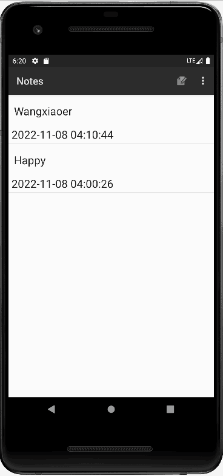
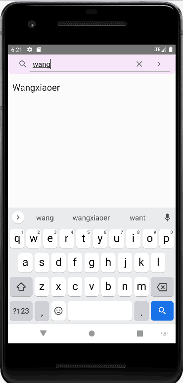

# NotePad
 ### 时间戳
 1.思路：从数据库把修改时间拿出来 <br>
 2.运行截图：<br>
 
 3.关键代码：<br>
 ```
 private static final String[] PROJECTION = new String[] {
            NotePad.Notes._ID, // 0
            NotePad.Notes.COLUMN_NAME_TITLE, // 1
            NotePad.Notes.COLUMN_NAME_MODIFICATION_DATE,  //4
    };

String[] dataColumns = { NotePad.Notes.COLUMN_NAME_TITLE, NotePad.Notes.COLUMN_NAME_MODIFICATION_DATE} ;

 int[] viewIDs = { android.R.id.text1,R.id.text2 };
 ```
 ### 查找功能
 1.思路：从数据库把修改时间拿出来 <br>
 2.运行截图：<br>
 
 3.关键代码：<br>
 ```
//布局文件
 <SearchView
        android:id="@+id/sv_search"
        android:layout_width="match_parent"
        android:layout_height="wrap_content"
        android:background="@drawable/shape_purple"
        android:iconifiedByDefault="false" />
    <ListView
        android:id="@+id/lv_search"
        android:layout_width="match_parent"
        android:layout_height="wrap_content"
        />

//处理逻辑代码

  rDB = MyDBHelper.getInstance(this).getrDB(); //获取数据库读权限
        search.setSubmitButtonEnabled(true);
        search.setQueryHint("查找");
        search.setOnQueryTextListener(this);

  String selection1 = NotePad.Notes.COLUMN_NAME_TITLE+" like ? or "+NotePad.Notes.COLUMN_NAME_NOTE+" like ?";

   String[] selection2 = {"%"+s+"%","%"+s+"%"};//搜索条件

 ```

 ### 导出笔记
 1.思路： 把笔记以文件的形式写入外部存储<br>
 2.运行截图：
 
 
 3.关键代码：<br>
 ```
String filename = et.getText().toString();
                //拿到文件名
                String content = getIntent().getExtras().getString("Content");
                //拿到文本
                String path = getExternalFilesDir(Environment.DIRECTORY_DOWNLOADS).toString() + separatorChar + filename + ".doc";
                //拿到文件存储位置
                Log.d("ning", path+content+filename);
                try {
                    fw = new FileWriter(path);
                    fw.write(content); //写入存储

 ```

### 改变listview的item的背景颜色
 1.思路： 动态设置颜色<br>
 2.运行截图：
 
 
 3.关键代码：<br>
 ```
super.bindView(view, context, cursor);//绑定视图
@SuppressLint("Range") int x = cursor.getInt(cursor.getColumnIndex(NotePad.Notes.COLUMN_NAME_BACK_COLOR));
        //获取列名
case NotePad.Notes.DEFAULT_COLOR:
                view.setBackgroundColor(Color.rgb(255, 255, 255));
                break;//设置白色

 ```