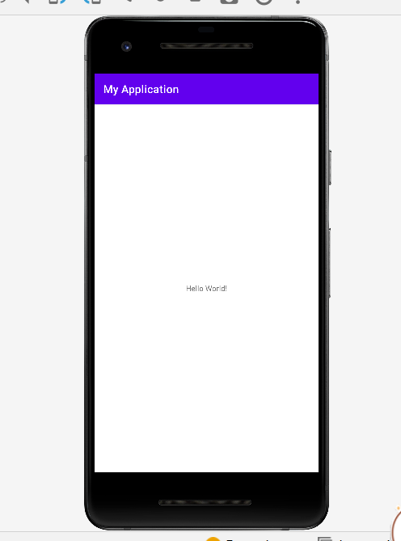
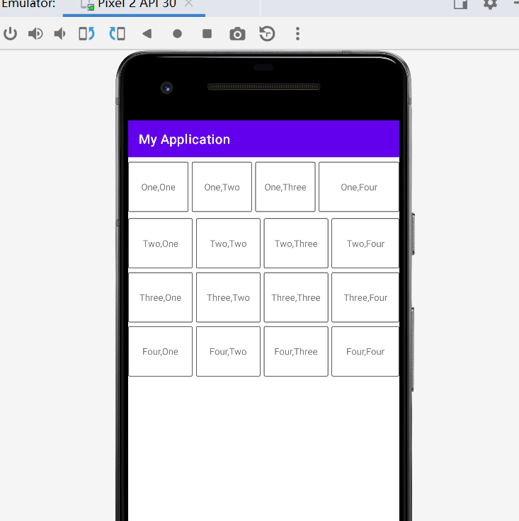
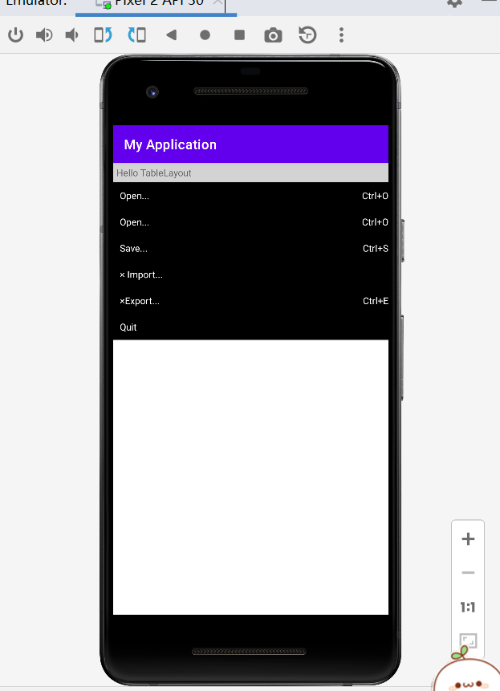
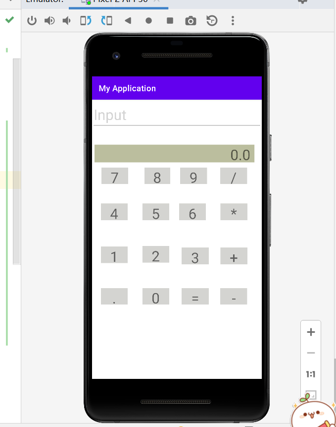
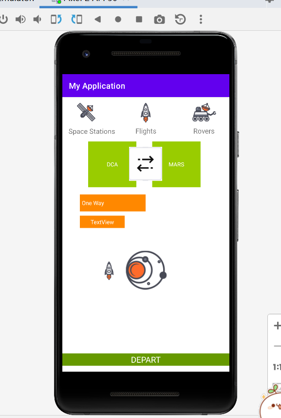

- HelloWorld

- LayOut

- 代码
``` LearLayOut
<LinearLayout
        android:layout_width="match_parent"
        android:layout_height="match_parent"
        android:orientation="vertical"
        app:layout_constraintBottom_toBottomOf="parent"
        tools:layout_editor_absoluteX="0dp">

        <LinearLayout
            android:layout_width="match_parent"
            android:layout_height="90dp"
            android:orientation="horizontal">

            <TextView
                android:background="@drawable/border_f"
                android:id="@+id/textView"
                android:layout_width="25dp"
                android:layout_height="76dp"
                android:layout_gravity="center"
                android:layout_marginRight="5dp"
                android:layout_weight="1"
                android:gravity="center"
                android:text="One,One" />

            <TextView
                android:background="@drawable/border_f"
                android:id="@+id/textView1"
                android:layout_width="25dp"
                android:layout_height="76dp"
                android:layout_gravity="center"
                android:layout_marginRight="5dp"
                android:layout_weight="1"
                android:gravity="center"
                android:text="One,Two" />

            <TextView
                android:background="@drawable/border_f"
                android:id="@+id/textView2"
                android:layout_width="25dp"
                android:layout_height="76dp"
                android:layout_gravity="center"
                android:layout_marginRight="5dp"
                android:layout_weight="1"
                android:gravity="center"
                android:text="One,Three" />

            <TextView
                android:background="@drawable/border_f"
                android:id="@+id/textView3"
                android:layout_width="wrap_content"
                android:layout_height="76dp"
                android:layout_gravity="center"
                android:layout_weight="1"
                android:gravity="center"
                android:text="One,Four" />

        </LinearLayout>

        <LinearLayout
            android:layout_width="match_parent"
            android:layout_height="82dp"
            android:orientation="horizontal">

            <TextView
                android:background="@drawable/border_f"
                android:id="@+id/textView4"
                android:layout_width="25dp"
                android:layout_height="76dp"
                android:layout_gravity="center"
                android:layout_marginRight="5dp"
                android:layout_weight="1"
                android:gravity="center"
                android:text="Two,One" />

            <TextView
                android:background="@drawable/border_f"
                android:id="@+id/textView5"
                android:layout_width="25dp"
                android:layout_height="76dp"
                android:layout_gravity="center"
                android:layout_marginRight="5dp"
                android:layout_weight="1"
                android:gravity="center"
                android:text="Two,Two" />

            <TextView
                android:background="@drawable/border_f"
                android:id="@+id/textView6"
                android:layout_width="25dp"
                android:layout_height="76dp"
                android:layout_gravity="center"
                android:layout_marginRight="5dp"
                android:layout_weight="1"
                android:gravity="center"
                android:text="Two,Three" />

            <TextView
                android:background="@drawable/border_f"
                android:id="@+id/textView7"
                android:layout_width="30dp"
                android:layout_height="76dp"
                android:layout_gravity="center"
                android:layout_weight="1"
                android:gravity="center"
                android:text="Two,Four" />

        </LinearLayout>

        <LinearLayout
            android:layout_width="match_parent"
            android:layout_height="82dp"
            android:orientation="horizontal">

            <TextView
                android:background="@drawable/border_f"
                android:id="@+id/textView8"
                android:layout_width="25dp"
                android:layout_height="76dp"
                android:layout_gravity="center"
                android:layout_marginRight="5dp"
                android:layout_weight="1"
                android:gravity="center"
                android:text="Three,One" />

            <TextView
                android:background="@drawable/border_f"
                android:id="@+id/textView9"
                android:layout_width="25dp"
                android:layout_height="76dp"
                android:layout_gravity="center"
                android:layout_marginRight="5dp"
                android:layout_weight="1"
                android:gravity="center"
                android:text="Three,Two" />

            <TextView
                android:background="@drawable/border_f"
                android:id="@+id/textView10"
                android:layout_width="25dp"
                android:layout_height="76dp"
                android:layout_gravity="center"
                android:layout_marginRight="5dp"
                android:layout_weight="1"
                android:gravity="center"
                android:text="Three,Three" />

            <TextView
                android:background="@drawable/border_f"
                android:id="@+id/textView11"
                android:layout_width="30dp"
                android:layout_height="76dp"
                android:layout_gravity="center"
                android:layout_weight="1"
                android:gravity="center"
                android:text="Three,Four" />

        </LinearLayout>

        <LinearLayout
            android:layout_width="match_parent"
            android:layout_height="82dp"
            android:orientation="horizontal">

            <TextView
                android:background="@drawable/border_f"
                android:id="@+id/textView12"
                android:layout_width="25dp"
                android:layout_height="76dp"
                android:layout_gravity="center"
                android:layout_marginRight="5dp"
                android:layout_weight="1"
                android:gravity="center"
                android:text="Four,One" />

            <TextView
                android:background="@drawable/border_f"
                android:id="@+id/textView13"
                android:layout_width="25dp"
                android:layout_height="76dp"
                android:layout_gravity="center"
                android:layout_marginRight="5dp"
                android:layout_weight="1"
                android:gravity="center"
                android:text="Four,Two" />

            <TextView
                android:background="@drawable/border_f"
                android:id="@+id/textView14"
                android:layout_width="25dp"
                android:layout_height="76dp"
                android:layout_gravity="center"
                android:layout_marginRight="5dp"
                android:layout_weight="1"
                android:gravity="center"
                android:text="Four,Three" />

            <TextView
                android:background="@drawable/border_f"
                android:id="@+id/textView15"
                android:layout_width="30dp"
                android:layout_height="76dp"
                android:layout_gravity="center"
                android:layout_weight="1"
                android:gravity="center"
                android:text="Four,Four" />

        </LinearLayout>
    </LinearLayout>
```
 -TableLayOut

```TableLayOut
<TableLayout
        android:layout_width="match_parent"
        android:layout_height="match_parent"
        app:layout_constraintBottom_toBottomOf="parent"
        app:layout_constraintEnd_toEndOf="parent"
        app:layout_constraintHorizontal_bias="0.0"
        app:layout_constraintStart_toStartOf="parent"
        app:layout_constraintTop_toTopOf="parent"
        app:layout_constraintVertical_bias="0.0">

        <TableRow>
            android:layout_width="match_parent"
            android:layout_height="match_parent">

            <TextView
                android:id="@+id/textView1"
                android:layout_width="match_parent"
                android:layout_height="match_parent"
                android:layout_gravity="top"
                android:layout_weight="1"
                android:background="@color/gray"
                android:gravity="left"
                android:padding="5dp"
                android:text="Hello TableLayout" />
        </TableRow>

        <TableRow>

            <TextView
                android:id="@+id/textView2"
                android:layout_width="match_parent"
                android:layout_height="match_parent"
                android:layout_column="0"
                android:layout_gravity="top"
                android:layout_weight="1"
                android:background="@color/black"
                android:gravity="left"
                android:padding="10dp"
                android:text="Open..."
                android:textColor="@color/white" />

            <TextView
                android:id="@+id/textView3"
                android:layout_width="match_parent"
                android:layout_height="match_parent"
                android:layout_column="1"
                android:layout_gravity="top"
                android:layout_weight="1"
                android:background="@color/black"
                android:gravity="right"
                android:paddingTop="10dp"
                android:text="Ctrl+O"
                android:textColor="@color/white" />
        </TableRow>

        <TableRow>

            <TextView
                android:id="@+id/textView4"
                android:layout_width="match_parent"
                android:layout_height="match_parent"
                android:layout_column="0"
                android:layout_gravity="top"
                android:layout_weight="1"
                android:background="@color/black"
                android:gravity="left"
                android:padding="10dp"
                android:text="Open..."
                android:textColor="@color/white" />

            <TextView
                android:id="@+id/textView5"
                android:layout_width="match_parent"
                android:layout_height="match_parent"
                android:layout_column="1"
                android:layout_gravity="top"
                android:layout_weight="1"
                android:background="@color/black"
                android:gravity="right"
                android:paddingTop="10dp"
                android:text="Ctrl+O"
                android:textColor="@color/white" />
        </TableRow>

        <TableRow>

            <TextView
                android:id="@+id/textView6"
                android:layout_width="match_parent"
                android:layout_height="match_parent"
                android:layout_column="0"
                android:layout_gravity="top"
                android:layout_weight="1"
                android:background="@color/black"
                android:gravity="left"
                android:padding="10dp"
                android:text="Save..."
                android:textColor="@color/white" />

            <TextView
                android:id="@+id/textView7"
                android:layout_width="match_parent"
                android:layout_height="match_parent"
                android:layout_column="1"
                android:layout_gravity="top"
                android:layout_weight="1"
                android:background="@color/black"
                android:gravity="right"
                android:paddingTop="10dp"
                android:text="Ctrl+S"
                android:textColor="@color/white" />
        </TableRow>

        <TableRow>

            <TextView
                android:id="@+id/textView8"
                android:layout_width="match_parent"
                android:layout_height="match_parent"
                android:layout_column="0"
                android:layout_gravity="top"
                android:layout_weight="1"
                android:background="@color/black"
                android:gravity="left"
                android:padding="10dp"
                android:text="× Import..."
                android:textColor="@color/white" />

            <TextView
                android:id="@+id/textView9"
                android:layout_width="match_parent"
                android:layout_height="match_parent"
                android:layout_column="1"
                android:layout_gravity="top"
                android:layout_weight="1"
                android:background="@color/black"
                android:gravity="right"
                android:paddingTop="10dp"
                android:textColor="@color/white" />
        </TableRow>

        <TableRow>

            <TextView
                android:id="@+id/textView10"
                android:layout_width="match_parent"
                android:layout_height="match_parent"
                android:layout_column="0"
                android:layout_gravity="top"
                android:layout_weight="1"
                android:background="@color/black"
                android:gravity="left"
                android:padding="10dp"
                android:text="×Export..."
                android:textColor="@color/white" />

            <TextView
                android:id="@+id/textView11"
                android:layout_width="match_parent"
                android:layout_height="match_parent"
                android:layout_column="1"
                android:layout_gravity="top"
                android:layout_weight="1"
                android:background="@color/black"
                android:gravity="right"
                android:paddingTop="10dp"
                android:text="Ctrl+E"
                android:textColor="@color/white" />
        </TableRow>

        <TableRow>

            <TextView
                android:id="@+id/textView12"
                android:layout_width="match_parent"
                android:layout_height="match_parent"
                android:layout_column="0"
                android:layout_gravity="top"
                android:layout_weight="1"
                android:background="@color/black"
                android:gravity="left"
                android:padding="10dp"
                android:text="Quit"
                android:textColor="@color/white" />

        </TableRow>
```
 #### ConstraintLayOut

```
<EditText
        android:id="@+id/editTextTextPersonName"
        android:layout_width="match_parent"
        android:layout_height="69dp"
        android:ems="10"
        android:inputType="textPersonName"
        android:text="Input"
        android:textColor="@color/gray"
        android:textSize="35dp"
        app:layout_constraintBottom_toBottomOf="parent"
        app:layout_constraintEnd_toEndOf="parent"
        app:layout_constraintStart_toStartOf="parent"
        app:layout_constraintTop_toTopOf="parent"
        app:layout_constraintVertical_bias="0.003" />

    <TextView
        android:id="@+id/textView16"
        android:layout_width="388dp"
        android:layout_height="43dp"
        android:background="@color/deep_green"
        android:gravity="right"
        android:paddingRight="10dp"
        android:text="0.0"
        android:textSize="35dp"
        app:layout_constraintBottom_toBottomOf="parent"
        app:layout_constraintEnd_toEndOf="@+id/textView20"
        app:layout_constraintHorizontal_bias="0.478"
        app:layout_constraintStart_toStartOf="@+id/textView17"
        app:layout_constraintTop_toBottomOf="@+id/editTextTextPersonName"
        app:layout_constraintVertical_bias="0.068" />

    <TextView
        android:id="@+id/textView17"
        android:layout_width="65dp"
        android:layout_height="40dp"
        android:background="@color/deep_gray"
        android:gravity="center"
        android:text="7"
        android:textSize="35dp"
        app:layout_constraintBottom_toTopOf="@+id/textView21"
        app:layout_constraintEnd_toStartOf="@+id/textView18"
        app:layout_constraintHorizontal_bias="0.362"
        app:layout_constraintStart_toStartOf="parent"
        app:layout_constraintTop_toTopOf="parent"
        app:layout_constraintVertical_bias="0.777" />

    <TextView
        android:id="@+id/textView18"
        android:layout_width="63dp"
        android:layout_height="40dp"
        android:layout_marginEnd="24dp"
        android:background="@color/deep_gray"
        android:gravity="center"
        android:text="8"
        android:textSize="35dp"
        app:layout_constraintBottom_toBottomOf="@+id/textView17"
        app:layout_constraintEnd_toStartOf="@+id/textView19"
        app:layout_constraintTop_toTopOf="@+id/textView17"
        app:layout_constraintVertical_bias="0.0" />

    <TextView
        android:id="@+id/textView19"
        android:layout_width="65dp"
        android:layout_height="40dp"
        android:layout_marginEnd="32dp"
        android:background="@color/deep_gray"
        android:gravity="center"
        android:text="9"
        android:textSize="35dp"
        app:layout_constraintBottom_toBottomOf="@+id/textView20"
        app:layout_constraintEnd_toStartOf="@+id/textView20"
        app:layout_constraintTop_toTopOf="@+id/textView20"
        app:layout_constraintVertical_bias="0.0" />

    <TextView
        android:id="@+id/textView20"
        android:layout_width="65dp"
        android:layout_height="40dp"
        android:background="@color/deep_gray"
        android:gravity="center"
        android:text="/"
        android:textSize="35dp"
        app:layout_constraintBottom_toBottomOf="@+id/textView18"
        app:layout_constraintEnd_toEndOf="parent"
        app:layout_constraintHorizontal_bias="0.898"
        app:layout_constraintStart_toStartOf="parent"
        app:layout_constraintTop_toTopOf="@+id/textView18"
        app:layout_constraintVertical_bias="0.0" />

    <TextView
        android:id="@+id/textView21"
        android:layout_width="65dp"
        android:layout_height="40dp"
        android:layout_marginBottom="64dp"
        android:background="@color/deep_gray"
        android:gravity="center"
        android:text="4"
        android:textSize="35dp"
        app:layout_constraintBottom_toTopOf="@+id/textView29"
        app:layout_constraintEnd_toStartOf="@+id/textView22"
        app:layout_constraintHorizontal_bias="0.378"
        app:layout_constraintStart_toStartOf="parent"
        app:layout_constraintTop_toTopOf="parent"
        app:layout_constraintVertical_bias="1.0" />

    <TextView
        android:id="@+id/textView22"
        android:layout_width="65dp"
        android:layout_height="40dp"
        android:background="@color/deep_gray"
        android:gravity="center"
        android:text="5"
        android:textSize="35dp"
        app:layout_constraintBottom_toBottomOf="@+id/textView21"
        app:layout_constraintEnd_toEndOf="parent"
        app:layout_constraintHorizontal_bias="0.352"
        app:layout_constraintStart_toStartOf="parent"
        app:layout_constraintTop_toTopOf="@+id/textView21"
        app:layout_constraintVertical_bias="0.0" />

    <TextView
        android:id="@+id/textView23"
        android:layout_width="65dp"
        android:layout_height="40dp"
        android:layout_marginStart="24dp"
        android:background="@color/deep_gray"
        android:gravity="center"
        android:text="6"
        android:textSize="35dp"
        app:layout_constraintBottom_toBottomOf="@+id/textView22"
        app:layout_constraintStart_toEndOf="@+id/textView22"
        app:layout_constraintTop_toTopOf="@+id/textView22"
        app:layout_constraintVertical_bias="0.0" />

    <TextView
        android:id="@+id/textView24"
        android:layout_width="65dp"
        android:layout_height="40dp"
        android:background="@color/deep_gray"
        android:gravity="center"
        android:text="*"
        android:textSize="35dp"
        app:layout_constraintBottom_toBottomOf="@+id/textView23"
        app:layout_constraintEnd_toEndOf="parent"
        app:layout_constraintStart_toEndOf="@+id/textView23"
        app:layout_constraintTop_toTopOf="@+id/textView23" />

    <TextView
        android:id="@+id/textView25"
        android:layout_width="65dp"
        android:layout_height="40dp"
        android:background="@color/deep_gray"
        android:gravity="center"
        android:text="."
        android:textSize="35dp"
        app:layout_constraintBottom_toBottomOf="parent"
        app:layout_constraintEnd_toStartOf="@+id/textView26"
        app:layout_constraintHorizontal_bias="0.378"
        app:layout_constraintStart_toStartOf="parent"
        app:layout_constraintTop_toTopOf="parent"
        app:layout_constraintVertical_bias="0.717" />

    <TextView
        android:id="@+id/textView26"
        android:layout_width="65dp"
        android:layout_height="40dp"
        android:background="@color/deep_gray"
        android:gravity="center"
        android:text="0"
        android:textSize="35dp"
        app:layout_constraintBottom_toBottomOf="@+id/textView25"
        app:layout_constraintEnd_toEndOf="parent"
        app:layout_constraintHorizontal_bias="0.352"
        app:layout_constraintStart_toStartOf="parent"
        app:layout_constraintTop_toTopOf="@+id/textView25"
        app:layout_constraintVertical_bias="0.0" />

    <TextView
        android:id="@+id/textView27"
        android:layout_width="65dp"
        android:layout_height="40dp"
        android:layout_marginStart="16dp"
        android:background="@color/deep_gray"
        android:gravity="center"
        android:text="="
        android:textSize="35dp"
        app:layout_constraintBottom_toBottomOf="@+id/textView26"
        app:layout_constraintEnd_toEndOf="@+id/textView31"
        app:layout_constraintHorizontal_bias="1.0"
        app:layout_constraintStart_toEndOf="@+id/textView26"
        app:layout_constraintTop_toTopOf="@+id/textView26"
        app:layout_constraintVertical_bias="0.0" />

    <TextView
        android:id="@+id/textView28"
        android:layout_width="65dp"
        android:layout_height="40dp"
        android:background="@color/deep_gray"
        android:gravity="center"
        android:text="-"
        android:textSize="35dp"
        app:layout_constraintBottom_toBottomOf="@+id/textView27"
        app:layout_constraintEnd_toEndOf="parent"
        app:layout_constraintHorizontal_bias="0.444"
        app:layout_constraintStart_toEndOf="@+id/textView27"
        app:layout_constraintTop_toTopOf="@+id/textView27"
        app:layout_constraintVertical_bias="0.0" />

    <TextView
        android:id="@+id/textView29"
        android:layout_width="65dp"
        android:layout_height="40dp"
        android:layout_marginBottom="60dp"
        android:background="@color/deep_gray"
        android:gravity="center"
        android:text="1"
        android:textSize="35dp"
        app:layout_constraintBottom_toTopOf="@+id/textView25"
        app:layout_constraintEnd_toStartOf="@+id/textView30"
        app:layout_constraintHorizontal_bias="0.378"
        app:layout_constraintStart_toStartOf="parent" />

    <TextView
        android:id="@+id/textView30"
        android:layout_width="65dp"
        android:layout_height="40dp"
        android:layout_marginBottom="60dp"
        android:background="@color/deep_gray"
        android:gravity="center"
        android:text="2"
        android:textSize="35dp"
        app:layout_constraintBottom_toTopOf="@+id/textView26"
        app:layout_constraintEnd_toEndOf="parent"
        app:layout_constraintHorizontal_bias="0.352"
        app:layout_constraintStart_toStartOf="parent"
        app:layout_constraintTop_toBottomOf="@+id/textView22"
        app:layout_constraintVertical_bias="0.984" />

    <TextView
        android:id="@+id/textView31"
        android:layout_width="65dp"
        android:layout_height="40dp"
        android:background="@color/deep_gray"
        android:gravity="center"
        android:text="3"
        android:textSize="35dp"
        app:layout_constraintBottom_toTopOf="@+id/textView27"
        app:layout_constraintEnd_toEndOf="parent"
        app:layout_constraintHorizontal_bias="0.191"
        app:layout_constraintStart_toEndOf="@+id/textView30"
        app:layout_constraintTop_toTopOf="parent"
        app:layout_constraintVertical_bias="0.862" />

    <TextView
        android:id="@+id/textView32"
        android:layout_width="65dp"
        android:layout_height="40dp"
        android:layout_marginStart="44dp"
        android:background="@color/deep_gray"
        android:gravity="center"
        android:text="+"
        android:textSize="35dp"
        app:layout_constraintBottom_toBottomOf="@+id/textView31"
        app:layout_constraintEnd_toEndOf="parent"
        app:layout_constraintHorizontal_bias="0.884"
        app:layout_constraintStart_toStartOf="parent"
        app:layout_constraintTop_toTopOf="@+id/textView31"
        app:layout_constraintVertical_bias="0.0" />
```
###ConstraintLayOut2

```
<ImageView
        android:id="@+id/imageView"
        android:layout_width="85dp"
        android:layout_height="46dp"
        app:layout_constraintBottom_toBottomOf="@+id/imageView2"
        app:layout_constraintEnd_toStartOf="@+id/imageView2"
        app:layout_constraintHorizontal_bias="0.173"
        app:layout_constraintStart_toStartOf="parent"
        app:layout_constraintTop_toTopOf="@+id/imageView2"
        app:layout_constraintVertical_bias="0.0"
        app:srcCompat="@drawable/space_station_icon" />

    <ImageView
        android:id="@+id/imageView2"
        android:layout_width="57dp"
        android:layout_height="49dp"
        app:layout_constraintBottom_toBottomOf="parent"
        app:layout_constraintEnd_toEndOf="parent"
        app:layout_constraintStart_toStartOf="parent"
        app:layout_constraintTop_toTopOf="parent"
        app:layout_constraintVertical_bias="0.023"
        app:srcCompat="@drawable/rocket_icon" />

    <ImageView
        android:id="@+id/imageView8"
        android:layout_width="52dp"
        android:layout_height="46dp"
        android:layout_marginEnd="48dp"
        app:layout_constraintBottom_toBottomOf="parent"
        app:layout_constraintEnd_toEndOf="parent"
        app:layout_constraintHorizontal_bias="0.286"
        app:layout_constraintStart_toStartOf="parent"
        app:layout_constraintTop_toTopOf="parent"
        app:layout_constraintVertical_bias="0.643"
        app:srcCompat="@drawable/rocket_icon" />

    <ImageView
        android:id="@+id/imageView3"
        android:layout_width="78dp"
        android:layout_height="46dp"
        android:layout_marginStart="76dp"
        app:layout_constraintBottom_toBottomOf="@+id/imageView2"
        app:layout_constraintEnd_toEndOf="parent"
        app:layout_constraintHorizontal_bias="0.0"
        app:layout_constraintStart_toEndOf="@+id/imageView2"
        app:layout_constraintTop_toTopOf="@+id/imageView2"
        app:layout_constraintVertical_bias="0.0"
        app:srcCompat="@drawable/rover_icon" />

    <ImageView
        android:id="@+id/imageView7"
        android:layout_width="105dp"
        android:layout_height="96dp"
        android:layout_marginTop="8dp"
        android:layout_marginEnd="152dp"
        app:layout_constraintBottom_toBottomOf="parent"
        app:layout_constraintEnd_toEndOf="parent"
        app:layout_constraintTop_toBottomOf="@+id/imageView5"
        app:layout_constraintVertical_bias="0.447"
        app:srcCompat="@drawable/galaxy" />

    <TextView
        android:id="@+id/textView33"
        android:layout_width="wrap_content"
        android:layout_height="wrap_content"
        android:text="Space Stations"
        android:textSize="17dp"
        app:layout_constraintBottom_toBottomOf="parent"
        app:layout_constraintEnd_toStartOf="@+id/textView34"
        app:layout_constraintHorizontal_bias="0.235"
        app:layout_constraintStart_toStartOf="parent"
        app:layout_constraintTop_toTopOf="parent"
        app:layout_constraintVertical_bias="0.111" />

    <TextView
        android:id="@+id/textView34"
        android:layout_width="wrap_content"
        android:layout_height="wrap_content"
        android:text="Flights"
        android:textSize="17dp"
        app:layout_constraintBottom_toBottomOf="parent"
        app:layout_constraintEnd_toEndOf="parent"
        app:layout_constraintStart_toStartOf="parent"
        app:layout_constraintTop_toTopOf="parent"
        app:layout_constraintVertical_bias="0.11" />

    <TextView
        android:id="@+id/textView35"
        android:layout_width="wrap_content"
        android:layout_height="wrap_content"
        android:layout_marginEnd="36dp"
        android:text="Rovers"
        android:textSize="17dp"
        app:layout_constraintBottom_toBottomOf="parent"
        app:layout_constraintEnd_toEndOf="parent"
        app:layout_constraintHorizontal_bias="1.0"
        app:layout_constraintStart_toEndOf="@+id/textView34"
        app:layout_constraintTop_toTopOf="parent"
        app:layout_constraintVertical_bias="0.11" />

    <TextView
        android:id="@+id/textView36"
        android:layout_width="119dp"
        android:layout_height="112dp"
        android:background="@android:color/holo_green_light"
        android:gravity="center"
        android:text="DCA"
        android:textColor="@color/white"
        app:layout_constraintBottom_toBottomOf="parent"
        app:layout_constraintEnd_toStartOf="@+id/textView37"
        app:layout_constraintHorizontal_bias="0.621"
        app:layout_constraintStart_toStartOf="parent"
        app:layout_constraintTop_toTopOf="parent"
        app:layout_constraintVertical_bias="0.195" />

    <TextView
        android:id="@+id/textView37"
        android:layout_width="119dp"
        android:layout_height="112dp"
        android:background="@android:color/holo_green_light"
        android:gravity="center"

        android:text="MARS"
        android:textColor="@color/white"
        app:layout_constraintBottom_toBottomOf="parent"
        app:layout_constraintEnd_toEndOf="parent"
        app:layout_constraintHorizontal_bias="0.756"
        app:layout_constraintStart_toStartOf="parent"
        app:layout_constraintTop_toTopOf="parent"
        app:layout_constraintVertical_bias="0.195" />

    <ImageView
        android:id="@+id/imageView5"
        android:layout_width="86dp"
        android:layout_height="83dp"
        app:layout_constraintBottom_toBottomOf="@+id/textView38"
        app:layout_constraintEnd_toEndOf="parent"
        app:layout_constraintHorizontal_bias="0.498"
        app:layout_constraintStart_toStartOf="parent"
        app:layout_constraintTop_toTopOf="parent"
        app:layout_constraintVertical_bias="0.213"
        app:srcCompat="@drawable/double_arrows" />

    <TextView
        android:id="@+id/textView38"
        android:layout_width="match_parent"
        android:layout_height="30dp"
        android:background="@android:color/holo_green_dark"
        android:gravity="center"
        android:text="DEPART"
        android:textColor="@color/white"
        android:textSize="20dp"
        app:layout_constraintBottom_toBottomOf="parent"
        app:layout_constraintEnd_toEndOf="parent"
        app:layout_constraintHorizontal_bias="1.0"
        app:layout_constraintStart_toStartOf="parent"
        app:layout_constraintTop_toTopOf="parent"
        app:layout_constraintVertical_bias="0.977" />

    <TextView
        android:id="@+id/textView39"
        android:layout_width="162dp"
        android:layout_height="42dp"
        android:background="@android:color/holo_orange_dark"
        android:gravity="center_vertical|left"
        android:paddingLeft="5dp"
        android:text="One Way"
        android:textColor="@color/white"
        app:layout_constraintBottom_toBottomOf="parent"
        app:layout_constraintEnd_toEndOf="parent"
        app:layout_constraintHorizontal_bias="0.172"
        app:layout_constraintStart_toStartOf="parent"
        app:layout_constraintTop_toTopOf="parent"
        app:layout_constraintVertical_bias="0.378" />

    <TextView
        android:id="@+id/textView40"
        android:layout_width="111dp"
        android:layout_height="30dp"
        android:background="@android:color/holo_orange_dark"
        android:gravity="center"
        android:text="TextView"
        android:textColor="@color/white"
        app:layout_constraintBottom_toBottomOf="parent"
        app:layout_constraintEnd_toEndOf="@+id/textView39"
        app:layout_constraintHorizontal_bias="0.0"
        app:layout_constraintStart_toStartOf="@+id/textView39"
        app:layout_constraintTop_toTopOf="parent"
        app:layout_constraintVertical_bias="0.453" />
```
