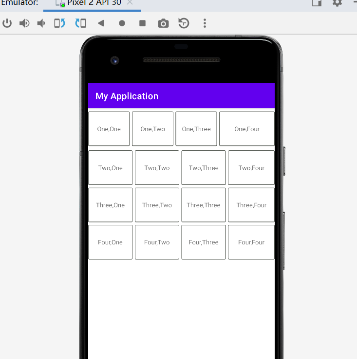
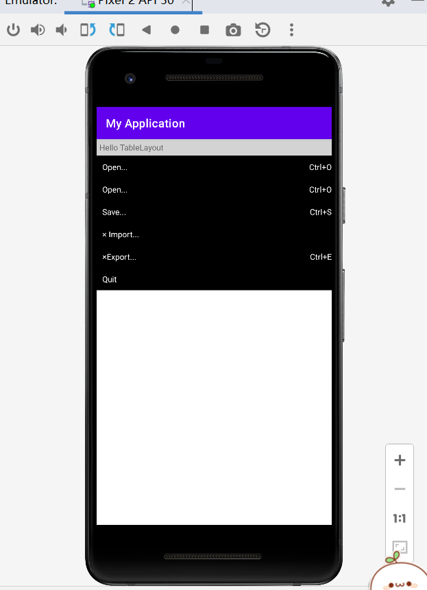
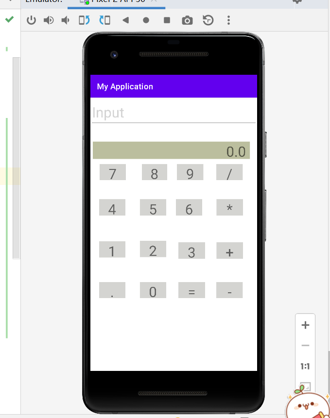
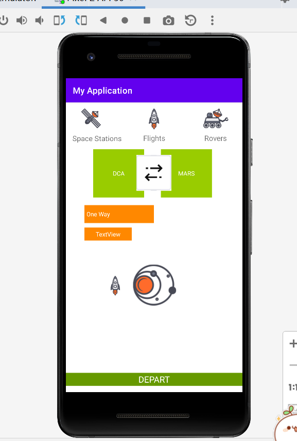

 ## 实验一 HelloWorld <br>

 # 实验二 布局文件
 ## LinearLayOut

- 部分代码
``` LinearLayOut

            <TextView
                android:background="@drawable/border_f"
                android:id="@+id/textView14"
                android:layout_width="25dp"
                android:layout_height="76dp"
                android:layout_gravity="center"
                android:layout_marginRight="5dp"
                android:layout_weight="1"
                android:gravity="center"
                android:text="Four,Three" />

            <TextView
                android:background="@drawable/border_f"
                android:id="@+id/textView15"
                android:layout_width="30dp"
                android:layout_height="76dp"
                android:layout_gravity="center"
                android:layout_weight="1"
                android:gravity="center"
                android:text="Four,Four" />

```
 ## TableLayOut <br>
 <br>
- 部分代码
```TableLayOut

        <TableRow>

            <TextView
                android:id="@+id/textView8"
                android:layout_width="match_parent"
                android:layout_height="match_parent"
                android:layout_column="0"
                android:layout_gravity="top"
                android:layout_weight="1"
                android:background="@color/black"
                android:gravity="left"
                android:padding="10dp"
                android:text="× Import..."
                android:textColor="@color/white" />

            <TextView
                android:id="@+id/textView9"
                android:layout_width="match_parent"
                android:layout_height="match_parent"
                android:layout_column="1"
                android:layout_gravity="top"
                android:layout_weight="1"
                android:background="@color/black"
                android:gravity="right"
                android:paddingTop="10dp"
                android:textColor="@color/white" />
        </TableRow>

```
 ## ConstraintLayOut

```
<EditText
        android:id="@+id/editTextTextPersonName"
        android:layout_width="match_parent"
        android:layout_height="69dp"
        android:ems="10"
        android:inputType="textPersonName"
        android:text="Input"
        android:textColor="@color/gray"
        android:textSize="35dp"
        app:layout_constraintBottom_toBottomOf="parent"
        app:layout_constraintEnd_toEndOf="parent"
        app:layout_constraintStart_toStartOf="parent"
        app:layout_constraintTop_toTopOf="parent"
        app:layout_constraintVertical_bias="0.003" />

 
    <TextView
        android:id="@+id/textView32"
        android:layout_width="65dp"
        android:layout_height="40dp"
        android:layout_marginStart="44dp"
        android:background="@color/deep_gray"
        android:gravity="center"
        android:text="+"
        android:textSize="35dp"
        app:layout_constraintBottom_toBottomOf="@+id/textView31"
        app:layout_constraintEnd_toEndOf="parent"
        app:layout_constraintHorizontal_bias="0.884"
        app:layout_constraintStart_toStartOf="parent"
        app:layout_constraintTop_toTopOf="@+id/textView31"
        app:layout_constraintVertical_bias="0.0" />
```
 ## ConstraintLayOut2
 <br>
```

    <ImageView
        android:id="@+id/imageView5"
        android:layout_width="86dp"
        android:layout_height="83dp"
        app:layout_constraintBottom_toBottomOf="@+id/textView38"
        app:layout_constraintEnd_toEndOf="parent"
        app:layout_constraintHorizontal_bias="0.498"
        app:layout_constraintStart_toStartOf="parent"
        app:layout_constraintTop_toTopOf="parent"
        app:layout_constraintVertical_bias="0.213"
        app:srcCompat="@drawable/double_arrows" />

   
    <TextView
        android:id="@+id/textView40"
        android:layout_width="111dp"
        android:layout_height="30dp"
        android:background="@android:color/holo_orange_dark"
        android:gravity="center"
        android:text="TextView"
        android:textColor="@color/white"
        app:layout_constraintBottom_toBottomOf="parent"
        app:layout_constraintEnd_toEndOf="@+id/textView39"
        app:layout_constraintHorizontal_bias="0.0"
        app:layout_constraintStart_toStartOf="@+id/textView39"
        app:layout_constraintTop_toTopOf="parent"
        app:layout_constraintVertical_bias="0.453" />
```
