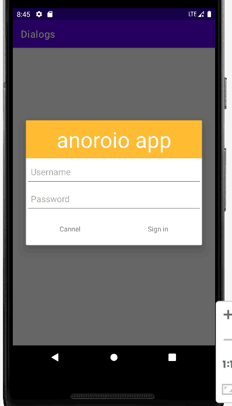
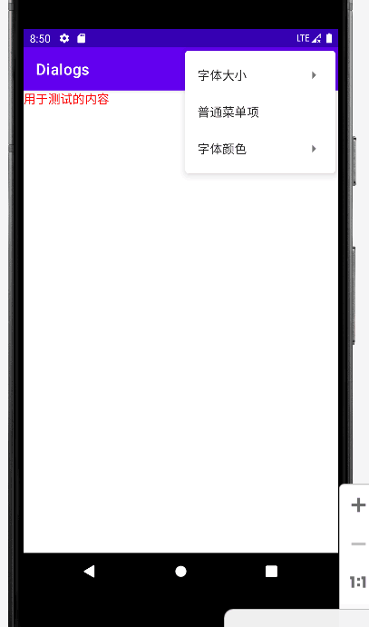
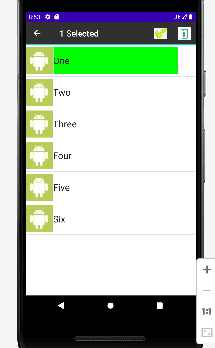

 # Android界面组件实验
 - 利用SimpleAdapter实现如下界面效果

   1. 代码思路：用simpleAdapter组装列表组件再将其放入列表中
   2. 关键代码：
```public class MainActivity4 extends AppCompatActivity {
    private String[] docs = new String[]{"Lion","Tiger","Monkey","Dog","Cat","elephant"};
    private int[] imgs = new int[]{R.drawable.lion, R.drawable.tiger,R.drawable.monkey,R.drawable.dog,R.drawable.cat,R.drawable.elephant};
    @SuppressLint("ResourceAsColor")
    @Override
    protected void onCreate(Bundle savedInstanceState) {
        super.onCreate(savedInstanceState);
        setContentView(R.layout.activity_main4);
        List<Map<String,Object>> listitems = new ArrayList<>();
        for (int i = 0; i < docs.length; i++) {
            Map<String,Object> listitem = new HashMap<>();
            listitem.put("doc",docs[i]);
            listitem.put("img",imgs[i]);
            listitems.add(listitem);
        }
        SimpleAdapter simpleAdapter = new SimpleAdapter(this,listitems,R.layout.simple_item,new String[]{"doc","img"},new int[]{R.id.doc,R.id.img});
        ListView list = findViewById(R.id.mylist);
        list.setAdapter(simpleAdapter);
        list.setOnItemClickListener((adapterView, view, i, l) -> {
            view.setBackgroundColor(R.color.purple_500);
            String s = docs[i];
            Toast.makeText(MainActivity4.this,s,Toast.LENGTH_SHORT).show();
        });
    }
} ```

 - 创建如图所示的自定义对话框

   1. 代码思路：用serView吧布局文件放到AlertDialog中
   2. 关键代码：
 ```         setContentView(R.layout.activity_main);
        new AlertDialog.Builder(this)
                .setView(R.layout.alertdialog)
                .show();
 ```

  - 使用XML定义菜单

   1. 代码思路：嵌套menu
   2. 关键代码：
 ```        
   switch (item.getItemId()) {
                case R.id.menu_size_1:
                    test.setTextSize(11);
                    return true;
                case R.id.menu_size_2:
                    test.setTextSize(16);
                    return true;
                case R.id.menu_size_3:
                    test.setTextSize(21);
                    return true;
                case R.id.menu_common:
                    Toast.makeText(MainActivity2.this, "这是普通菜单项", Toast.LENGTH_SHORT).show();
                    return true;
                case R.id.menu_color_red:
                    test.setTextColor(Color.RED);
                    return true;
                case R.id.menu_color_yellow:
                    test.setTextColor(Color.YELLOW);
                    return true;
                default:
                    return super.onOptionsItemSelected(item);
 ```

 - 创建上下文操作模式(ActionMode)的上下文菜单

   1. 代码思路：利用actionMode
   2. 关键代码：
 ```        
          	MenuInflater inflater = mode.getMenuInflater();
                inflater.inflate(R.menu.problem04_action_mode, menu);
                num = 0;
                adapter.notifyDataSetChanged();
                return true;
 ```